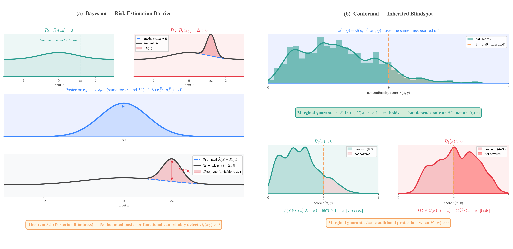
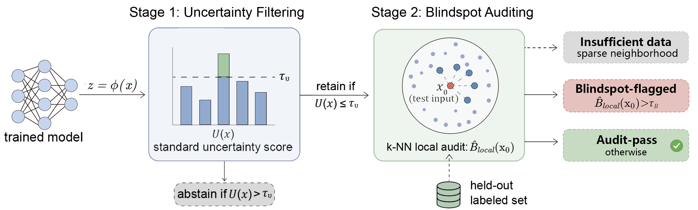

# Code submission — *The Structural Barrier to Pointwise Risk Assessment in Bayesian and Conformal Prediction*

Candidate Number: **1099874** · Master of Science Thesis · Trinity 2026.

This package contains the code that produced every figure and table reported in
the dissertation. The repository is organised so that each numbered figure or
table maps onto a single, self-contained entry-point script under
`figures_and_tables/`, while the underlying algorithm
($\widehat{B}_{\mathrm{local}}$ estimator and the Stage-2 audit flag) lives in
`core/` and the supporting model / data / inference utilities live in
`utils/`. The LLM experiments have their own subdirectory (`llm/`).

## Overview at a glance

Bayesian posterior summaries and model-based conformal prediction sets both
depend on the same fitted predictive law $p_{\theta^*}(y \mid x)$ — so the
pointwise risk gap $B_\ell(x_0)$ induced by local misspecification is a
*common* blind spot of the two paradigms (Fig 1.1).



To bypass that blind spot we propose a two-stage deployment protocol
(Fig 3.2): Stage 1 abstains on inputs with high uncertainty $U(x)$;
Stage 2 audits the remaining confident tier with the k-NN local estimator
$\widehat{B}_{\mathrm{local}}(x_0)$, flagging blindspots and
insufficient-data inputs.



---

## 1. Repository layout

```
code submit/
├── README.md                           # This file
├── configs/
│   └── default.yaml                    # Vision-side hyperparameters
├── core/                               # Chapter 3, §3.4 — the audit estimator
│   ├── b_local.py                      # B̂_local(x) — Eq. (3.13), k = 50 main
│   └── flag.py                         # Stage-2 audit flag (τ_B, d_max from LOO)
├── utils/
│   ├── backbone.py                     # ResNet-20 (main) + ResNet-18, WRN-28-10
│   ├── feature_extractor.py            # Feature caches for k-NN
│   ├── splits.py                       # CIFAR-10 / SVHN / CIFAR-100 loaders
│   ├── llla.py                         # LLLA inference (Chap. 4 Bayesian Stage-1)
│   ├── swag.py                         # Last-layer SWAG (Bayesian baseline)
│   └── conformal.py                    # Split conformal with APS scores
├── figures_and_tables/                 # One entry-point per dissertation figure / table
│   ├── fig3_1_blindspot_map.py         # Fig 3.1 — t-SNE audit recovery
│   ├── tab4_1_posterior_blindspot.py   # Table 4.1 — LLLA / SWAG blindspot
│   ├── tab4_2_conformal_blindspot.py   # Table 4.2 — APS conformal blindspot
│   ├── fig4_1_tier_risk_curves.py      # Fig 4.1 + Table 4.3 — rejection curves
│   ├── fig4_2_ablation_A.py            # Fig 4.2 — Stage-2 ranker comparison (Top-30%)
│   ├── fig4_3_k_sensitivity.py         # Fig 4.3 — sensitivity to k
│   ├── tab4_4_llm_blindspot.py         # Table 4.4 — Llama-3-8B / BoolQ / PubMedQA
│   ├── fig4_4_llm_rejection_curves.py  # Fig 4.4 — LLM rejection curves
│   └── _src_*.py                       # Backends called by the entry-point scripts
├── llm/                                # Chapter 4, §4.3 — language pipeline
│   ├── main.py                         # End-to-end: LoRA + LLLA + B̂_local
│   ├── config.py                       # `STAGE = "full"` → meta-llama/Meta-Llama-3-8B
│   ├── data.py                         # BoolQ + PubMedQA (yes/no subset)
│   ├── model.py                        # LoRA fine-tune, LLLA on the head
│   └── estimator.py                    # k-NN B̂_local in feature space
└── figures/                            # Representative rendered figures
    ├── fig1_1_structure_barrier.png
    ├── fig3_1_blindspot_map_CIFAR-10-C_severity_3.png
    ├── fig3_2_two_stage_pipeline.png
    ├── fig4_1_tier_risk_curves_medium.png
    ├── fig4_2_ablation_A_rejectors_cov30.png
    ├── fig4_3_k_sensitivity_bar.png
    └── fig4_4_llm_rejection_curves.png
```

---

## 2. Mapping figures and tables to code

The dissertation contains seven numbered figures and four tables in the main
text. Every one of them has a dedicated entry-point under
`figures_and_tables/`.

| Dissertation reference | Caption (abridged) | Entry-point |
|---|---|---|
| Fig 1.1 (§1) | Shared structural barrier in Bayesian and conformal prediction (conceptual). | static — `figures/fig1_1_structure_barrier.png` |
| Fig 3.1 (§3.4.1) | t-SNE on CIFAR-10-C sev 3, coloured by H[p̄], $\widehat{B}_{\mathrm{local}}$, and the Stage-2 flag. | `figures_and_tables/fig3_1_blindspot_map.py` |
| Fig 3.2 (§3.4.2) | Two-stage deployment protocol diagram (conceptual). | static — `figures/fig3_2_two_stage_pipeline.png` |
| Table 4.1 (§4.2.2) | Posterior blindspot detection on vision benchmarks (LLLA + SWAG). | `figures_and_tables/tab4_1_posterior_blindspot.py` |
| Table 4.2 (§4.2.2) | Conformal blindspot detection on vision benchmarks (APS). | `figures_and_tables/tab4_2_conformal_blindspot.py` |
| Fig 4.1 (§4.2.3) | Rejection curves at coverage 70% / 80% / 90%. | `figures_and_tables/fig4_1_tier_risk_curves.py` |
| Table 4.3 (§4.2.3) | Risk reduction by Stage-2 rejection at r ∈ {0,10,20,30,40}%. | `figures_and_tables/fig4_1_tier_risk_curves.py` (same backend) |
| Fig 4.2 (§4.2.4) | Stage-2 ranker comparison within the Top-30% confident tier. | `figures_and_tables/fig4_2_ablation_A.py` |
| Fig 4.3 (§4.2.5) | Sensitivity of $\widehat{B}_{\mathrm{local}}$-guided rejection to k. | `figures_and_tables/fig4_3_k_sensitivity.py` |
| Table 4.4 (§4.3.2) | Posterior blindspot detection on language benchmarks. | `figures_and_tables/tab4_4_llm_blindspot.py` |
| Fig 4.4 (§4.3.3) | LLM rejection curves at coverage 70% / 80% / 90%. | `figures_and_tables/fig4_4_llm_rejection_curves.py` |

---

## 3. Pipeline at a glance (matches Chapter 4, §4.1)

For each scenario the code runs, in order:

1. **Train backbone** (`utils/backbone.py`): a CIFAR-10 ResNet-20 with cosine
   annealing for 200 epochs (vision side); for the LLM side, LoRA fine-tuning
   on `meta-llama/Meta-Llama-3-8B`'s `q_proj` / `v_proj` modules.
2. **Stage-1 — Bayesian or conformal predictor**:
   * **LLLA** (`utils/llla.py`): last-layer Laplace via `laplace-torch`, prior
     precision selected by marginal likelihood. Outputs predictive entropy
     H[p̄] and mutual information MI.
   * **SWAG** (`utils/swag.py`): low-rank Gaussian over the SGD trajectory
     (full network).
   * **APS** (`utils/conformal.py`): split conformal with adaptive prediction
     sets at α = 0.1.
3. **Stage-2 — audit via $\widehat{B}_{\mathrm{local}}$**:
   * `core/b_local.py` runs the k-NN estimator from Theorem 3.3:
     $$\widehat{B}_{\mathrm{local}}(x_0) = \tfrac{1}{k} \sum_{j \in N_k(x_0)} z_\ell(X'_j, Y'_j;\, \hat\theta_n).$$
     k = 50 (Dissertation §4.1).
   * `core/flag.py` derives both thresholds from a leave-one-out pass on the
     held-out set:
       * τ_B  ← Youden's J on the LOO ROC of $\widehat{B}_{\mathrm{local}}$
         vs misclassification.
       * d_max ← 95th percentile of LOO k-NN distances.

The two-stage pipeline is summarised in Fig 3.2.

---

## 4. Quick start

```bash
# 1) Install dependencies (Python ≥ 3.10)
pip install torch torchvision laplace-torch scikit-learn matplotlib pandas \
            scipy pyyaml tqdm transformers peft datasets

# 2) Train the ResNet-20 backbone on CIFAR-10
python utils/backbone.py --config configs/default.yaml

# 3) Fit LLLA, dump predictive distributions for every split
python utils/llla.py --config configs/default.yaml

# 4) Compute B̂_local + audit flags on every test split
python core/b_local.py --config configs/default.yaml --method llla
python core/flag.py    --config configs/default.yaml --method llla

# 5) Reproduce a specific table or figure
python figures_and_tables/tab4_1_posterior_blindspot.py --method llla --ood_fraction 0.5
python figures_and_tables/fig4_1_tier_risk_curves.py
python figures_and_tables/fig4_3_k_sensitivity.py

# 6) Language side (Llama-3-8B + BoolQ / PubMedQA)
#    Edit llm/config.py: set STAGE = "full".
python figures_and_tables/tab4_4_llm_blindspot.py
python figures_and_tables/fig4_4_llm_rejection_curves.py
```

---

## 5. Hyperparameters that match the dissertation

| Parameter | Value | Where stated in the thesis |
|---|---|---|
| Vision backbone | ResNet-20 / CIFAR-10 | §4.2.1 |
| LLM backbone | Llama-3-8B (frozen) + logistic head | §4.3.1 |
| Bayesian Stage-1 (vision) | LLLA (main); SWAG (full-network) | §4.2.1 |
| Conformal Stage-1 | APS, α = 0.1 | §4.2.1 |
| Stage-1 main coverage | 80% | §4.1 |
| Stage-2 estimator | k-NN, k = 50 (k-sensitivity in Fig 4.3) | §4.1 |
| τ_B calibration | Youden's J on hold-out LOO | §4.1 |
| d_max calibration | 95th percentile of hold-out LOO k-NN distances | §4.1 |
| Held-out validation share | 10 % of the training set | §4.1 |

These values are written directly into `configs/default.yaml` (vision) and
`llm/config.py` (LLM).

---

## 6. License and citation

If you use this code, please cite the thesis:

> *The Structural Barrier to Pointwise Risk Assessment in Bayesian and
> Conformal Prediction*, Candidate 1099874, MSc thesis, University of Oxford,
> Trinity 2026.
